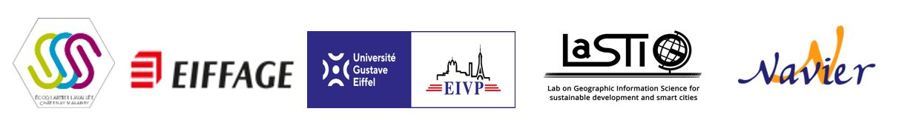

# E3S-project---Uses of City Information Models at the district and urban scale

## Présentation du projet
Le programme 3ES est un programme de recherche action co-financé par l'Univsersité Gustave Eiffel et Eiffage. Il rassemble 25 collaboratrices et collaborateurs d'Eiffage et 60 chercheuses et chercheurs de l'Université Gustave Eiffel. Il a pour objectif de développer des innovations urbaines sur le projet d'écoquartier La Vallée à Châtenay-Malabry.

Le [site web du projet](https://www.programme-e3s.com/le-programme/) présente l'ensemble de la démarche et des ateliers.

## Atelier 8 - usages décrits et prédits par le numérique

Le programme est structuré en atelier, dont un dédié aux usages urbains du City Information Model (CIM) du quartier. Cet atelier a été co-animé par Rachid Bearoussi pour le volet mobilité et Florence Jacquinod pour le volet usages urbains du CIM.

Le volet "usages urbains du CIM" a donné lieu à plusieurs actions, au sein de deux axes principaux de recherche exploratiore.

1. Evaluer l'intensité urbaine à l'échelle d'un quartier à l'aide du CIM
-Elaboration d'un indicateur d'intensité urbaine et calcul de cet indicateur grâce au CIM - thèse de doctorat d'Adeline Deprètre, encadrée par Florence Jacquinod, Bruno Barroca et Vincent Bécue.

2. Evaluer le potentiel du CIM pour l'ACV à l'échelle du quartier 
-Exploration des données du CIM pour leur utilisation pour l'ACV - stages de Charlotte Lauverjon et Marine Paty, enacdrés par Florence Jacquinod et Charlotte Roux
-Réalisation d'une ACV du quartier à partir du CIM et rédaction de recommentadations pour des CIM permettant la réalisation d'ACV - travail d'Alexandre Mielniczek, encadré par Florence Jacquinod et Charlotte Roux

## Financeurs
Le programme E3S a été financé par l'Université Gustave Eiffel et Eiffage 

<!--- 
## Livrables du projet
Pour le volet intensité urbaine : 
Le volet intensité urbaine a permis de proposer un indice d'intensité urbaine avec .

Pour le volet analyse du cycle de vie du quartier : 
-l'exploitation des données issues du CIM pour réaliser une analyse de cycle de vie (ACV) du qaurtier a été testée et des recommandations pour de futurs CIM permettant de réaliser des ACV

### Support de présentation du projet
La présentation générale du projet et de son déroulement est téléchargeable [en format PDF](assets/PRESENTATION_PROJET_FLOODAR.pdf). Cette présentation contient également une synthèse du retour d'expérience des deux expérimentations menées avec les riverains du rhône à Sablons. L'analyse plus complète des expérimentations est disponible ci-après (voir [retour d'expérience](https://github.com/jacquinod/FLOODAR/blob/main/README.md#retour-dexp%C3%A9rience-sur-lutilisation-de-g%C3%A9ovisualisations-interactives-et-immersives-sur-site-%C3%A0-sablons))

Des films de présentation des dispositifs produits sont mis à disposition via Dailymotion ([Outil Tablette](http://www.dailymotion.com/video/x5evbbi_flood-ar-outil-tablette-protocole-et-utilisation-sur-site_school) et [Outil Smartphone](http://www.dailymotion.com/video/x5ev9jx_flood-ar-outil-smartphone-demo-et-utilisation-sur-site-sablons-2016_school)).

### Méthodologie 
La méhtode employée est décrite dans les fichiers suivants : 

- [méthodologie générale](assets/01_methodologie_generale.pdf)
- [annexe 1](assets/02_annexe1.pdf) - géoréférencer des objets modélisés en 3D pour un export en OBJ avec SketchUp
- [annexe 2](assets/03_annexe2.pdf) - génération des vues avec Spaceyes 3D
- [annexe 3](assets/04_annexe3.pdf) - créer une visite virtuelle avec la logiciel Panotour

### Retour d'expérience sur l'utilisation de géovisualisations interactives et immersives sur site à Sablons
Le projet FLOOD AR a donné lieu à 2 expérimentation en 2016 sur le territoire de Sablons. 
Le [retour d'expérience sur le potentiel de ces outils et leurs limites](assets/Evaluation_dispositif_ELICO_V0317.pdf) a été réalisée par les chercheurs en sciences de l'information et de la communication de l'équipe Elico.

 --->

